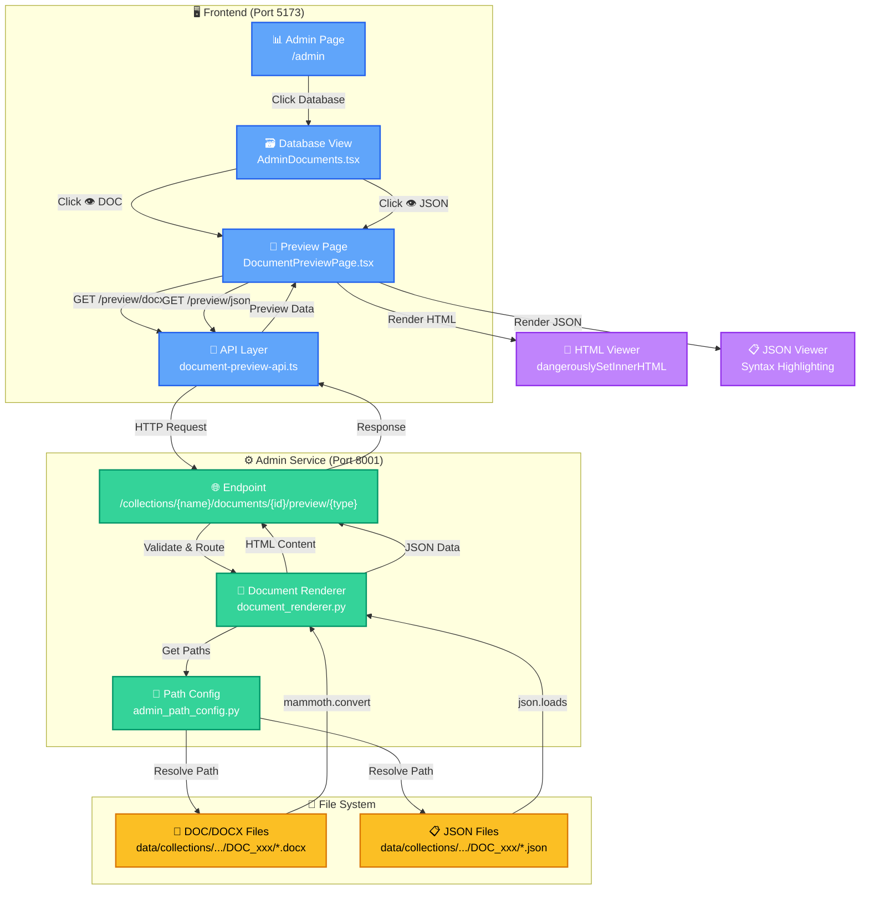

# 🏗️ Document Preview Architecture Diagram

## Luồng hoạt động:

### 1️⃣ User Interaction Flow

```
Admin Page → Database View → Click DOC/JSON Badge → Preview Page
```

### 2️⃣ API Communication Flow

```
Preview Page → document-preview-api.ts → Admin Service Endpoint
```

### 3️⃣ Backend Processing Flow

```
Endpoint → Document Renderer → Path Config → File System
```

### 4️⃣ Document Rendering Flow

```
DOCX File → mammoth.convert_to_html() → HTML Content
JSON File → json.loads() → JSON Data
```

### 5️⃣ Response & Display Flow

```
Renderer → Endpoint → API → Preview Page → Display Component
```

---

## 🎯 Key Components

### Frontend (React + TypeScript)

- **AdminPage**: Entry point cho admin panel
- **DatabaseView**: Hiển thị danh sách documents với badges
- **PreviewPage**: Full-page viewer cho document content
- **API Layer**: Centralized API calls với adminAPI

### Backend (FastAPI + Python)

- **Endpoint**: REST API endpoint với path validation
- **Document Renderer**: Core logic cho DOCX → HTML và JSON parsing
- **Path Config**: Environment-aware path resolution

### File System

- **DOC Files**: Original Word documents
- **JSON Files**: Processed document data

---

## 🔄 Request/Response Flow

### DOCX Preview Request

```typescript
// Frontend
navigate(`/admin/documents/${collection}/${docId}/preview/docx`)
  ↓
getDocxPreview(collection, docId)
  ↓
GET http://localhost:8001/collections/{collection}/documents/{docId}/preview/docx
```

### Backend Processing

```python
# Admin Service
preview_document(collection_name, doc_id, "docx")
  ↓
DocumentRenderer.get_document_preview_data(...)
  ↓
render_docx_to_html(docx_path)
  ↓
mammoth.convert_to_html(docx_file)
  ↓
return { success: true, html: "...", ... }
```

### Response Handling

```typescript
// Frontend
DocumentPreviewPage receives response
  ↓
dangerouslySetInnerHTML={{ __html: previewData.html }}
  ↓
User sees rendered document
```

---

## 🎨 UI Components Flow

```
AdminDocuments.tsx
├── Document Card
│   ├── Metadata (title, code, date, agency)
│   ├── Statistics (questions, forms)
│   └── Action Badges
│       ├── [👁 DOC]  ← onClick → navigate to preview
│       └── [👁 JSON] ← onClick → navigate to preview

DocumentPreviewPage.tsx
├── Header
│   ├── Breadcrumb Navigation
│   ├── Back Button
│   └── Download Button
├── Content Area
│   ├── Loading State (spinner)
│   ├── Error State (retry button)
│   └── Preview Content
│       ├── HTML Viewer (for DOCX)
│       └── JSON Viewer (for JSON)
```

---

## 🔐 Security Layers

1. **Collection Validation**: Check if collection exists
2. **Doc Type Validation**: Only allow "docx" or "json"
3. **Path Resolution**: Use PathConfig to prevent path traversal
4. **Error Messages**: Don't expose system paths
5. **CORS**: Configured for specific origins only

---

## ⚡ Performance Optimization

1. **Async Operations**: Non-blocking file I/O with aiofiles
2. **Lazy Loading**: Preview page only loads when accessed
3. **Caching Ready**: Can add Redis cache for rendered HTML
4. **Streaming**: Large files can be streamed (future enhancement)

---

## 🚀 Deployment Architecture

```
Docker Container 1: Frontend
├── nginx serving static files
└── Port 3000/5173

Docker Container 2: Admin Service
├── FastAPI + Uvicorn
├── Document Renderer
└── Port 8001

Docker Volume: Data
└── /data/collections/
    ├── Bo_thu_tuc/
    │   └── documents/
    │       └── DOC_xxx/
    │           ├── document.docx
    │           └── document.json
    ...
```

---

## 📊 Data Flow Summary

```
User Click → Navigate → API Call → Backend → File System
                                      ↓
                                 Render/Parse
                                      ↓
                              JSON Response
                                      ↓
                              Frontend Display
                                      ↓
                                User Views
```

---

This architecture ensures:

- ✅ **Scalability**: Easy to add more document types
- ✅ **Maintainability**: Clear separation of concerns
- ✅ **Security**: Multiple validation layers
- ✅ **Performance**: Async operations, caching ready
- ✅ **UX**: Full-page viewing, bookmarkable URLs
- ✅ **Docker-ready**: No hardcoded paths
