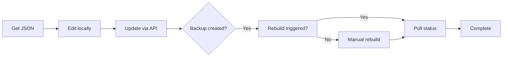

# 🧪 JSON Document CRUD - Testing Guide

## 📋 Prerequisites

1. **Docker services running**:

   ```powershell
   cd prod
   docker-compose up -d
   ```

2. **Verify services are healthy**:

   ```powershell
   # Check RAG Service
   curl http://localhost:8000/health

   # Check Admin Service
   curl http://localhost:8001/health
   ```

3. **Get a valid collection and document ID**:

   ```powershell
   # List collections
   curl http://localhost:8001/api/collections

   # List documents in a collection (replace 'Bo_thu_tuc' with actual collection name)
   curl http://localhost:8001/api/collections/Bo_thu_tuc/documents
   ```

---

## 🚀 Testing Methods

### Method 1: Automated PowerShell Script

**Run the test script**:

```powershell
cd test
.\test_json_crud_api.ps1
```

**Edit variables** in the script before running:

```powershell
$COLLECTION = "Bo_thu_tuc"  # Your collection name
$DOC_ID = "DOC_001"         # Your document ID
```

---

### Method 2: Swagger UI (Recommended)

#### Admin Service Swagger

1. Open: http://localhost:8001/docs
2. Navigate to **json-documents** tag
3. Try endpoints interactively

#### RAG Internal Service Swagger

1. Open: http://localhost:8000/docs
2. Navigate to **internal-json** tag
3. **Remember to set `X-Internal-API-Key` header**: `dev-internal-key`

---

### Method 3: Manual cURL Commands

#### 1. Get JSON Document (Admin Service)

```powershell
curl -X GET "http://localhost:8001/api/collections/Bo_thu_tuc/documents/DOC_001/json" `
  -H "Content-Type: application/json"
```

**Expected Response**:

```json
{
  "success": true,
  "data": {
    "id": "DOC_001",
    "title": "...",
    "sections": []
  },
  "collection": "Bo_thu_tuc",
  "doc_id": "DOC_001"
}
```

---

#### 2. Update JSON Document

```powershell
$body = @{
  data = @{
    id = "DOC_001"
    title = "Updated Title"
    sections = @()
  }
  trigger_rebuild = $false  # Set to true to trigger rebuild
} | ConvertTo-Json -Depth 10

curl -X PUT "http://localhost:8001/api/collections/Bo_thu_tuc/documents/DOC_001/json" `
  -H "Content-Type: application/json" `
  -d $body
```

**Expected Response**:

```json
{
  "success": true,
  "message": "JSON document updated for DOC_001",
  "backup_created": true,
  "backup_path": "data/storage/collections/Bo_thu_tuc/documents/DOC_001/DOC_001.json.backup.20251012_143022",
  "rebuild_triggered": false
}
```

---

#### 3. List Backups

```powershell
curl -X GET "http://localhost:8001/api/collections/Bo_thu_tuc/documents/DOC_001/json/backups" `
  -H "Content-Type: application/json"
```

**Expected Response**:

```json
{
  "success": true,
  "data": [
    {
      "filename": "DOC_001.json.backup.20251012_143022",
      "timestamp": "20251012_143022",
      "size": 15240,
      "created_at": "2025-10-12T14:30:22"
    }
  ],
  "total": 1
}
```

---

#### 4. Restore from Backup

```powershell
$body = @{
  backup_filename = "DOC_001.json.backup.20251012_143022"
  trigger_rebuild = $false
} | ConvertTo-Json

curl -X POST "http://localhost:8001/api/collections/Bo_thu_tuc/documents/DOC_001/json/restore" `
  -H "Content-Type: application/json" `
  -d $body
```

---

#### 5. Trigger Manual Rebuild

```powershell
$body = @{
  scope = "document"
} | ConvertTo-Json

curl -X POST "http://localhost:8001/api/collections/Bo_thu_tuc/documents/DOC_001/json/rebuild" `
  -H "Content-Type: application/json" `
  -d $body
```

---

#### 6. Check Rebuild Status

```powershell
curl -X GET "http://localhost:8001/api/collections/Bo_thu_tuc/documents/DOC_001/json/rebuild/status" `
  -H "Content-Type: application/json"
```

**Expected Response**:

```json
{
  "success": true,
  "data": {
    "status": "running",
    "progress": 45.5,
    "message": "Generating embeddings...",
    "scope": "document",
    "collection": "Bo_thu_tuc",
    "doc_id": "DOC_001"
  },
  "is_relevant": true
}
```

---

## 🧩 Testing RAG Internal APIs Directly

### Important: Requires API Key Header

All internal APIs require `X-Internal-API-Key` header:

```powershell
$headers = @{
    "X-Internal-API-Key" = "dev-internal-key"
}
```

### Example: Get JSON (RAG Internal)

```powershell
curl -X GET "http://localhost:8000/api/internal/json/collections/Bo_thu_tuc/documents/DOC_001" `
  -H "X-Internal-API-Key: dev-internal-key" `
  -H "Content-Type: application/json"
```

### Example: Update JSON (RAG Internal)

```powershell
$body = @{
  data = @{
    id = "DOC_001"
    title = "Test"
    sections = @()
  }
  auto_rebuild = $false
} | ConvertTo-Json -Depth 10

curl -X PUT "http://localhost:8000/api/internal/json/collections/Bo_thu_tuc/documents/DOC_001" `
  -H "X-Internal-API-Key: dev-internal-key" `
  -H "Content-Type: application/json" `
  -d $body
```

---

## ✅ Test Checklist

### Basic Functionality

- [ ] Get JSON document (Admin API)
- [ ] Get JSON document (RAG Internal API)
- [ ] List backups (empty list OK)
- [ ] Update JSON with `trigger_rebuild=false`
- [ ] Verify backup created
- [ ] List backups again (should show new backup)
- [ ] Restore from backup
- [ ] Verify JSON reverted

### Rebuild Integration

- [ ] Update JSON with `trigger_rebuild=true`
- [ ] Check rebuild status immediately
- [ ] Poll rebuild status until complete
- [ ] Verify cache updated (check RAG search results)

### Error Handling

- [ ] Try to get non-existent collection → 404
- [ ] Try to get non-existent document → 404
- [ ] Try to update with invalid JSON structure → 400
- [ ] Try to restore non-existent backup → 404
- [ ] Try RAG Internal API without API key → 403

---

## 🐛 Troubleshooting

### Issue: "Collection not found"

**Solution**: Check available collections:

```powershell
curl http://localhost:8001/api/collections
```

### Issue: "Document not found"

**Solution**: Check documents in collection:

```powershell
curl "http://localhost:8001/api/collections/<COLLECTION>/documents"
```

### Issue: "Invalid JSON structure"

**Solution**: Ensure JSON has required fields:

- `id` (string)
- `title` (string)
- `sections` (array)

### Issue: "Forbidden - Invalid internal API key"

**Solution**: Add header to RAG Internal API calls:

```powershell
-H "X-Internal-API-Key: dev-internal-key"
```

### Issue: Rebuild not working

**Solution**:

1. Check rebuild script exists: `rag_service/tools/rebuild_selective.py`
2. Check rebuild status file: `rag_service/data/cache/rebuild_status.json`
3. Check docker logs: `docker logs legalrag-rag-service`

---

## 📊 Expected Workflow



---

## 🎯 Success Criteria

✅ **All tests pass** when:

1. Can retrieve JSON document
2. Can update JSON document
3. Backup is created automatically
4. Can list backups
5. Can restore from backup
6. Rebuild triggers successfully (optional)
7. All error cases return proper HTTP status codes

---

## 📝 Notes

- **Backup naming**: `{doc_id}.json.backup.{timestamp}`
- **Timestamp format**: `YYYYMMDD_HHMMSS`
- **API key**: `dev-internal-key` (for internal APIs only)
- **Rebuild scope**: `document` | `collection` | `all`
- **Default auto_rebuild**: `true` (can be disabled)

---

## 🔗 Additional Resources

- **Admin Service Swagger**: http://localhost:8001/docs
- **RAG Service Swagger**: http://localhost:8000/docs
- **Architecture Doc**: `docs/ADMIN_SERVICE_ARCHITECTURE.md`
- **Implementation Checklist**: `docs/JSON_CRUD_IMPLEMENTATION_CHECKLIST.md`

---

**Last Updated**: 2025-10-12  
**Status**: ✅ Backend implementation complete, ready for testing
